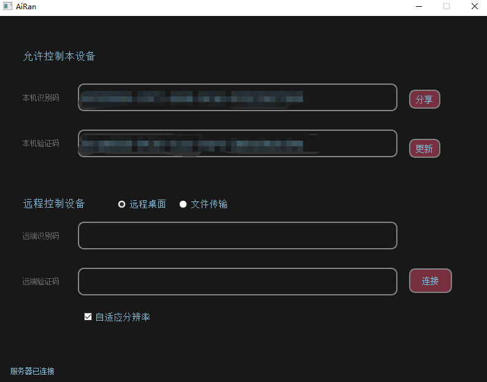
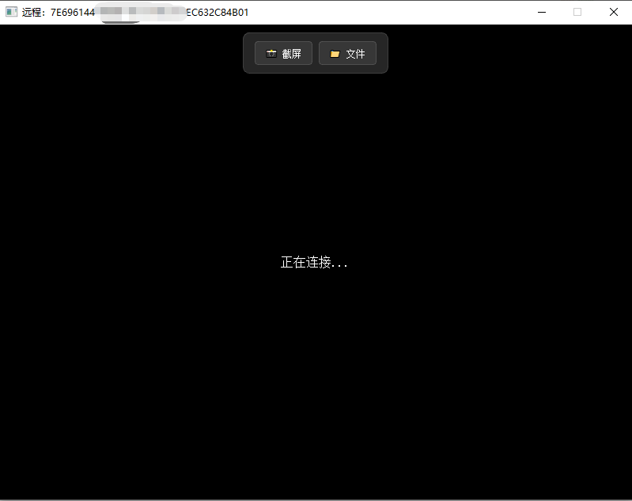

# airan-desk

airan-desk 是一个基于 WebRTC 技术的远程桌面控制应用程序，支持 Windows 7 以上 和 Linux （g++ >= 9 版本） 平台。

#### 已测试可正常编译使用（其余版本自测）：

##### Win7_32位

- FFmpeg 7.1.3 + Qt5.9.9
- FFmpeg 7.1.3 + Qt5.15.2

##### Win10_64位

- FFmpeg 7.1.3 + Qt5.9.9
- FFmpeg 7.1.3 + Qt5.15.2

##### Ubuntu 18.04 armhf

- FFmpeg: 4.1.4 + Qt5.9.5 (apt安装)

##### Ubuntu 22.04 x64

- FFmpeg: 4.4.2 + Qt5.15.3 (apt安装)

## 功能特性

- 基于 WebRTC 的实时视频传输
- 跨平台支持（Windows/Linux）
- 远程桌面控制
- 文件传输功能
- 低延迟的视频编解码

## 零拷贝

- 必须安装最新显卡官方的驱动，Windows自动安装的不行

## 界面




## 构建依赖

### 第三方库

本项目使用了以下优秀的开源库：

- **[Qt5](https://www.qt.io/)** - 跨平台 C++ 应用程序开发框架
  - qt5-base (Core, GUI, Widgets)
  - qt5-websockets - WebSocket 通信支持
- **[libdatachannel](https://github.com/paullouisageneau/libdatachannel)** - WebRTC 数据通道实现
- **[spdlog](https://github.com/gabime/spdlog)** - 快速 C++ 日志库
- **[ffmpeg](https://github.com/FFmpeg/FFmpeg)** - 多媒体框架，用于视频编解码
- **[FFmpeg-Builds](https://github.com/BtbN/FFmpeg-Builds.git)** - 打包完成的 ffmpeg 库

## 构建指南

### Windows

#### 前置要求

1. **安装开发工具**
   - Visual Studio 2019 以上版本
   - CMake 3.21 或更高版本（建议 最新 版本）
   - Git

2. **安装 Qt5**
   - 下载并安装 Qt 5.9 以上版本（建议使用 Qt 官方在线安装器）
   - 选择 MSVC 2019 32-bit 或 64-bit 组件（根据需要选择）
   - 记录 Qt 安装路径，例如：`C:/Qt/5.15.2/msvc2019` 或 `C:/Qt/5.15.2/msvc2019_64`

3. **克隆代码并初始化子模块**
   ```cmd
   git clone <repository-url>
   cd airan-desk
   git submodule update --init --recursive
   ```

#### 安装依赖

1. **OpenSSL 1.1.1w**
   - 下载并安装 [Win32OpenSSL-1_1_1w.exe](https://wiki.overbyte.eu/arch/openssl-1.1.1w-win32.zip)（32 位）
   - 下载并安装 [Win64OpenSSL-1_1_1w.exe](https://wiki.overbyte.eu/arch/openssl-1.1.1w-win64.zip)（64 位）
   - 默认安装路径：`C:/Program Files/OpenSSL-Win32` 和 `C:/Program Files/OpenSSL-Win64`

2. **FFmpeg 预编译库**
   - 从 [FFmpeg-Builds](https://github.com/BtbN/FFmpeg-Builds.git) 下载对应系统版本的预编译库解压到自定义目录下

#### 编译（32 位）

```cmd
cmake --preset win7-x86-msvc
cmake --build --preset win7-x86-msvc --config Release
```

#### 编译（64 位）

```cmd
cmake --preset win10-x64-msvc
cmake --build --preset win10-x64-msvc --config Release
```

编译完成后，可执行文件位于：

- 32 位：`out/build/win7-x86-msvc/release/airan-desk.exe`
- 64 位：`out/build/win10-x64-msvc/release/airan-desk.exe`

所有必需的 DLL（Qt、FFmpeg、OpenSSL、spdlog、datachannel）会自动复制到可执行文件目录。

### Linux

#### 前置要求

1. **安装开发工具**

   ```bash
   # Ubuntu/Debian
   sudo apt update
   sudo apt install build-essential cmake git pkg-config

   # CentOS/RHEL
   sudo yum update
   sudo yum install gcc gcc-c++ cmake git pkg-config
   ```

2. **克隆代码并初始化子模块**
   ```bash
   git clone <repository-url>
   cd airan-desk
   git submodule update --init --recursive
   ```

#### 安装依赖

**Ubuntu/Debian**
**Ubuntu/Debian**

```bash
sudo apt update
sudo apt install \
    qtbase5-dev \
    libqt5websockets5-dev \
    libssl-dev \
    libavcodec-dev \
    libavformat-dev \
    libavutil-dev \
    libswscale-dev \
    libswresample-dev \
    libavdevice-dev \
    libx11-dev \
    libxv-dev \
    libasound2-dev \
    libxtst-dev
```

**CentOS/RHEL**

```bash
sudo yum update
sudo yum install \
    qt5-qtbase-devel \
    qt5-qtwebsockets-devel \
    openssl-devel \
    ffmpeg-devel \
    libX11-devel \
    libXtst-devel
```

**Arch Linux**

```bash
sudo pacman -S \
    qt5-base \
    qt5-websockets \
    openssl \
    ffmpeg \
    libx11 \
    libxtst
```

#### 编译（64 位）

```bash
# 配置项目
cmake --preset linux-x64

# 编译
cmake --build --preset linux-x64 -j$(nproc)

# 或者使用 make
cd out/build/linux-x64
make -j$(nproc)
```

编译完成后，可执行文件位于：`out/build/linux-x64/airan-desk`

#### 运行

```bash
cd out/build/linux-x64/release
./airan-desk
```

#### 编译(armv7)

```bash
# 配置项目
cmake --preset linux-arm

# 编译
cmake --build --preset linux-arm -j$(nproc)

# 或者使用 make
cd out/build/linux-arm
make -j$(nproc)
```

编译完成后，可执行文件位于：`out/build/linux-arm/airan-desk`

#### 运行

```bash
cd out/build/linux-arm/release
./airan-desk
```

## 目录结构

```
airan-desk/
├── CMakeLists.txt          # 主 CMake 配置文件
├── CMakePresets.json       # CMake 预设配置
├── README.md               # 本文件
├── LICENSE                 # 许可证文件
├── resource/               # 资源目录
│   ├── conf/               # 配置文件目录
│   ├── locale/             # 国际化文件目录
│   ├── main.rc             # Windows 资源文件
│   └── uac.manifest        # Windows UAC 清单
├── src/                    # 源代码目录
│   ├── main.cpp           # 主程序入口
│   ├── main_window.*      # 主窗口
│   ├── control_window.*   # 控制窗口
│   ├── file_transfer_window.* # 文件传输窗口
│   ├── common/            # 通用工具
│   ├── util/              # 工具类
│   ├── video/             # 媒体编解码
│   ├── webrtc/            # WebRTC 相关
│   └── websocket/         # WebSocket 相关
└── third_party/           # 第三方依赖
    ├── libdatachannel/    # WebRTC 库（子模块）
    ├── spdlog/            # 日志库（子模块）
```

## 配置文件

编译完成后，配置文件会自动复制到输出目录：

- `config.ini` - 主配置文件，包含以下配置项：
  - `signal_server.wsUrl` - 信令服务器的 WebSocket URL（**必须配置为你自己的服务器地址**）
  - 其他应用配置项
- `locale/` - 国际化文件目录（Qt 翻译文件）

### config.ini 示例

```ini
[signal_server]
wsUrl=wss://your-signal-server.com/ws

[application]
# 其他配置项...
```

## 故障排除

### Windows 常见问题

1. **找不到 Qt 模块**
   - 确保在 `CMakePresets.json` 中正确设置了 `CMAKE_PREFIX_PATH`
   - 检查 Qt 安装路径是否正确

2. **缺少 DLL 文件**
   - 所有依赖的 DLL 应该在编译后自动复制到输出目录
   - 如果仍然缺少，请检查 CMakeLists.txt 中的 POST_BUILD 拷贝命令是否正确执行

3. **0xc000007b 错误（架构不匹配）**
   - 确保所有 DLL（Qt、FFmpeg、OpenSSL）都是相同架构（全部 x86 或全部 x64）
   - 检查 CMakePresets.json 中的架构设置

4. **OpenSSL 版本冲突**
   - 如果系统中安装了 vcpkg，可能会干扰 OpenSSL 查找
   - CMakeLists.txt 已配置禁用 vcpkg 工具链，如果仍有问题，请清空构建缓存后重新配置

### Linux 常见问题

1. **找不到 Qt5 模块**

   ```bash
   # 检查是否安装了所有必需的 Qt5 开发包
   dpkg -l | grep qt5  # Ubuntu/Debian
   rpm -qa | grep qt5  # CentOS/RHEL
   ```

2. **找不到 FFmpeg 库**

   ```bash
   # 检查 FFmpeg 开发包是否安装
   pkg-config --modversion libavcodec
   pkg-config --modversion libavformat
   ```

3. **链接错误**
   - 确保所有子模块都已正确初始化：
     ```bash
     git submodule update --init --recursive
     ```

### 清理构建缓存

如果遇到奇怪的配置或编译问题，尝试清理构建缓存：

**Windows:**

```cmd
rmdir /s /q out\build
```

**Linux:**

```bash
rm -rf out/build
```

然后重新配置和编译项目。

## 致谢

感谢以下开源项目和作者的贡献：

- **Qt Team** - 提供了强大的跨平台开发框架 [Qt](https://www.qt.io/)
- **FFmpeg Team** - 提供了功能完善的多媒体处理库 [FFmpeg](https://ffmpeg.org/)
- **BtbN** - 提供了预编译的多媒体处理库 [FFmpeg-Builds](https://github.com/BtbN/FFmpeg-Builds)
- **Paul-Louis Ageneau** - 开发了优秀的 WebRTC 库 [libdatachannel](https://github.com/paullouisageneau/libdatachannel)
- **Gabi Melman** - 开发了高性能日志库 [spdlog](https://github.com/gabime/spdlog)

## 许可证

本项目采用开源许可证，详见 [LICENSE](LICENSE) 文件。

## 贡献

欢迎提交 Issue 和 Pull Request 来改进本项目。

## 联系方式

如有问题或建议，请通过 GitHub Issues 联系我们。
